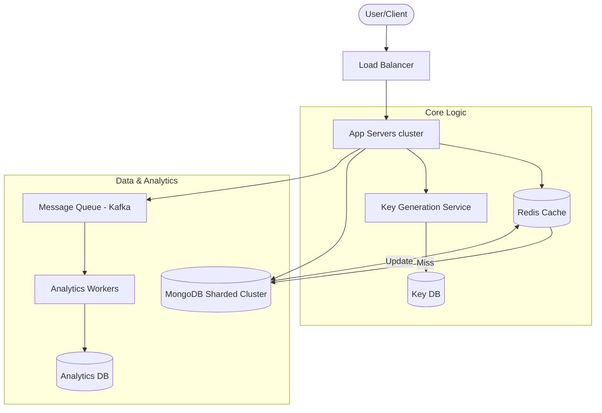

# System Design: High-Scale URL Shortener

This document outlines the architecture for a high-performance, globally distributed URL shortener service designed to handle billions of redirections per day with sub-10ms latency.

---

## 1. Requirements Clarification

### Functional Requirements
- **URL Shortening**: Create a short, unique alias for a given long URL.
- **Redirection**: Redirect users from a short URL to the original long URL.
- **Custom Aliases**: Allow users to define their own short codes (e.g., `tiny.cc/my-brand`).
- **Link Expiration**: Support optional expiration dates for shortened links.

### Non-Functional Requirements
- **High Scalability**: Support 100 million new URLs per day and 10 billion redirections per day (100:1 Read/Write ratio).
- **Low Latency**: Redirection should be extremely fast, ideally served from the edge.
- **High Availability**: 99.99% uptime; the redirection path must be resilient to failures.
- **Reliability**: Links must be persisted for 5 years without data loss.

---

## 2. Capacity Estimation

| Metric | Estimate |
| :--- | :--- |
| **New URLs (Writes)** | 100M per day (~1,160 RPS) |
| **Redirections (Reads)** | 10B per day (~116,000 RPS) |
| **Total Records (5 Years)** | ~182.5 Billion |
| **Storage (Total)** | ~91 Terabytes (assuming 500 bytes per record) |
| **Cache Size (20% Daily Reads)** | ~1 Terabyte RAM |
| **Bandwidth (Outgoing)** | ~58 MB/s |

---

## 3. Design The Interfaces

The system uses a hybrid communication model: **REST** for public-facing client interactions and **gRPC** for high-performance internal service-to-service communication.

### Public API Endpoints
- `POST /api/v1/shorten`: Creates a short URL.
- `GET /{shortCode}`: Performs a 302 redirect to the original URL.
- `DELETE /api/v1/{shortCode}`: Manually expires a link.

### Internal gRPC
Used by the API Gateway to communicate with the **Shortening Service** and **Key Generation Service (KGS)** for high efficiency and low serialization latency.

---

## 4. High-Level Design (HLD)

The architecture leverages a **Key Generation Service (KGS)** to pre-generate unique IDs, ensuring fast writes and zero collisions.

---

## 5. Database Design

### Database Selection: **MongoDB (NoSQL)**
- **Justification**: Horizontally scalable via native sharding, handles massive write/read volumes, and its document model fits the key-value lookup pattern of a URL shortener.
- **Sharding Strategy**: Data is sharded by the `short_code` using **Consistent Hashing** to ensure even distribution across 91 TB of storage.

### Data Schema
- `short_code` (Primary Key, String)
- `long_url` (String)
- `custom_alias` (String, Optional)
- `created_at` (Timestamp)
- `expire_at` (Timestamp, Optional)
- `user_id` (UUID, Optional)

---

## 6. Scalability and Performance

- **Caching**: A **1TB Redis cluster** using an **LRU (Least Recently Used)** eviction policy stores the most frequently accessed redirections.
- **Global Performance**: **Global Edge Redirection (CDN)** is used to cache 302 redirect responses at the edge, reducing latency to <20ms for users worldwide.
- **Read Replicas**: MongoDB replica sets distribute read load within shards.

---

## 7. Reliability and Resiliency

- **KGS Redundancy**: Multiple KGS instances managed by **Zookeeper** prevent single points of failure in ID generation.
- **Availability**: **Active-Passive Multi-Region** architecture. One primary region handles writes, while read-only replicas and CDN edge nodes provide high availability globally.
- **Rate Limiting**: Implemented at the API Gateway to prevent service abuse.
- **Fault Tolerance**: Automatic failover via MongoDB Replica Sets and GSLB (Global Server Load Balancing).
