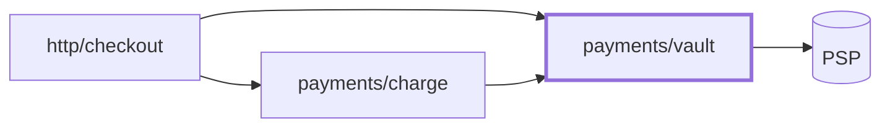

A diff says what moved, never what the author was trying to do. So this skill reads two
intentions — **stated**, what the author said the change is for, and **built**, what the code
now makes cheap and expensive — and the gap between them is **drift**. The map, the diagrams,
and the attention list all exist to make drift visible and say what to do about it.

**This skill changes no code.** The report is the whole deliverable.

The target decides which steps run:

| Mode | The target | Steps |
| --- | --- | --- |
| **Change review** | anything resolving to a diff — branch, PR, MR, CL, commit range, commit | all nine |
| **Survey** | code at rest — files, folders, or the whole repo | skip 2 and 4; step 5 compares the built shape against the documented one |

## 1. Resolve the target

| The user named | Resolve with | Mode |
| --- | --- | --- |
| A branch | `git diff <base>...<branch>` — three dots, so it diffs from the merge base | change |
| A GitHub PR | `gh pr view <n> --json title,body,baseRefName,headRefName,url,commits`, `gh pr diff <n>` | change |
| A GitLab MR | `glab mr view <n>`, `glab mr diff <n>` | change |
| A Gerrit CL | `git fetch origin refs/changes/<nn>/<change>/<patchset>`, then diff `FETCH_HEAD` against its parent | change |
| A commit range | `git diff A...B` where B is a branch tip; `A..B` where those literal commits are meant | change |
| One commit | `git show <sha>` | change |
| Files or folders | no base — read them as they stand | survey |
| The whole repo | no base | survey |
| Nothing | the files changed against the default branch, plus uncommitted work, recorded as your choice | change |

The default branch is not always `main`, and `origin/HEAD` is often absent:

```sh
base=$(git symbolic-ref --quiet --short refs/remotes/origin/HEAD 2>/dev/null)
if [ -z "$base" ]; then
  for c in origin/main origin/master origin/develop main master; do
    git rev-parse --verify --quiet "$c" >/dev/null && base=$c && break
  done
fi
[ -n "$base" ] && git diff --numstat "$base"...HEAD
```

`--numstat` gives the added and deleted counts the report asks for; `--name-only` gives paths
alone and leaves that field unfillable.

Two empties mean different things and neither is "nothing changed". An empty `$base` is no
branch to compare against: say so and ask for the target. An empty *diff* against a good base
is a branch already merged, or work still sitting in the working tree — the common case when
somebody types the skill's name on `main` after an afternoon's editing. Fall back to the
working tree there: `git diff --numstat HEAD` for tracked changes and `git status --porcelain`
for untracked files, and where that is empty too, say the tree is clean and ask for the target.

Uncommitted work is inside the scope whenever the user named no target, so step 9's dirty-tree
note describes code this review actually read.

Where a forge CLI is missing or unauthenticated, name it and ask for the branch instead: a PR
read from the local branch loses the description, which is step 2's best source.

A whole-repo survey is not a read of every file. Read the manifest, the entry points, the
layout, and the deploy config, follow the flow from each entry point to a store or an
outbound call, then read down the churn ranking until the map stops changing:

```sh
git log --since='6 months ago' --name-only --format= | grep . | sort | uniq -c | sort -rn | head -20
```

The `grep .` matters: `--name-only` prints a blank line between commits, and without it the
blank sorts to the top as your busiest file.

**Done when:** the mode is fixed; a change review has its base and head commits and the
changed files with their added and deleted counts, a survey has its file list; an empty diff
was resolved to the working tree or handed back as a question rather than reported as no
change; and a target you chose yourself is written down as your choice.

## 2. Read the intention as stated — change review

| Source | What it gives |
| --- | --- |
| The PR, MR, or CL description | the ask, in the form the reviewer was asked to agree to |
| The linked issue | the problem behind the ask, which the description often assumes |
| The commit messages across the range | the steps, and sometimes the reason for each |
| An ADR or design doc in the diff | the decision, and the alternatives that lost |
| The tests added | the behaviour the author is willing to claim |

Quote it. A paraphrase tidies the ask into something the code matches better than the
original did, and drift disappears in the tidying.

Where every source is silent — empty PR body, commits reading `fix`, `wip`, `fix again` —
record **no stated intention**. Reading it off the diff instead makes drift impossible to see
by construction, since the diff is the built intention. "The author stated no intent" is
itself a finding.

**Done when:** every source is read or recorded absent; the stated intention is in the
author's own words with a link; and silence is written down rather than filled in from the
diff.

## 3. Map the architecture as it stands

Build the map from the code. The docs are a claim to check in step 5:

| Element | Where to find it |
| --- | --- |
| **Entry points** | `main`, `cmd/`, route tables, handlers, queue consumers, cron jobs, CLI commands, exported surface |
| **Components** | the layout and the manifest's workspaces — one sentence of responsibility each |
| **Dependency arrows** | imports crossing a component boundary, with their direction |
| **Stores** | migrations, models, schemas, and which component writes to each |
| **Outbound calls** | HTTP clients, SDKs, brokers, caches, third parties |
| **Cross-cutting** | authentication, configuration, logging, transactions, error mapping |
| **Runtime shape** | processes, containers, deploy manifests, what scales apart from what |

A component owns one responsibility behind a boundary other code goes through; a folder with
no boundary belongs to the component that owns it.

On a change review, map the base too, reading each touched file's old version with `git show
<base>:<path>` rather than reasoning about what it used to be. Two maps are what make step
4's before-and-after honest. An added file has no base version and a deleted one has no head
version, so split them out first — `git diff --diff-filter=A --name-only "$base"...HEAD` and
`--diff-filter=D` — rather than letting `git show` fail on each one.

**Done when:** every entry point is named with its path; every component has its one
sentence; every cross-boundary arrow has a direction; every store names its writers; every
outbound call is listed; and a change review holds this map for both base and head.

## 4. Locate the change on the map — change review

Put every changed file under a component, then give every change a kind:

| Kind | The test |
| --- | --- |
| **New component** | a boundary exists that did not exist before |
| **Grown component** | a component took on a responsibility beyond the one it had |
| **Moved boundary** | a responsibility crossed from one component to another |
| **New arrow** | a component depends on something it did not depend on |
| **Reversed arrow** | an existing dependency changed direction |
| **New or reshaped store** | a table, collection, index, or schema added or changed |
| **New outbound dependency** | a call to something the system did not call before |
| **Behaviour only** | same components, same arrows, different code inside |

Most changes are **behaviour only**, and saying so plainly is a real result. Manufacturing
architecture out of a bug fix teaches the reader to skim the next report.

For every changed shared interface — exported function, base class, schema, event payload —
grep its call sites and give the **blast radius** as a count with the modules named. A
one-line change to something with 60 callers is a bigger change than a new file with none.

**Done when:** every changed file sits under a component; every change carries a kind; every
structural kind has its before and after from the two maps; every changed shared interface
carries a counted blast radius; and a behaviour-only change says so.

## 5. Read the intention as built, and name the drift

The built intention is what the shape makes cheap and what it makes expensive. Answer both:
what is now easy that was hard — the second payment provider, swapping the store, testing the
rule without a database — and what is now hard that was easy — deploying the halves
separately, reading the flow in one file.

Then compare stated against built. A survey has no statement, so compare the built shape
against what the README and ADRs claim; that drift is usually the larger one.

| Drift | What it looks like | Why it matters |
| --- | --- | --- |
| **Unbuilt** | the statement promises what the diff does not contain | the reviewer approves an ask that was not met |
| **Unstated** | the diff contains work the statement never mentions | scope nobody agreed to, reviewed by nobody looking for it |
| **Overbuilt** | an interface with one implementation, a config key for a constant, a plugin system for two cases | every later reader pays for flexibility nobody asked for |
| **Underbuilt** | the happy path only — no failure handling on a new outbound call, no migration for old rows | it works in review and fails in production |
| **Misplaced** | the right behaviour in the wrong component | the boundary erodes, and the next change erodes it further |

**Done when:** the built intention is written as what became cheap and what became expensive;
every drift entry carries its kind, the quoted statement or documented claim it contradicts,
and the paths; and a change with no drift says so.

## 6. Draw the diagrams that earn their place

A diagram earns its place when it answers a question the reader would otherwise hold in their
head across four files:

| The question | Diagram | Mermaid |
| --- | --- | --- |
| What talks to what, and which way does it point? | component | `flowchart LR` |
| In what order, across how many hops? | sequence | `sequenceDiagram` |
| Which transitions are legal? | state | `stateDiagram-v2` |
| What does the data relate to? | entity relationship | `erDiagram` |
| What runs where, and what scales apart? | deployment | `flowchart TB` with subgraphs |

Name every node after something in the code and caption each diagram with the question it
answers plus the paths, so a reader can go and find them. Where the change moved an arrow,
draw before and after with the same node names in the same order and a class on what changed,
so the moved arrow is the only difference. Quote any label holding more than letters, digits,
and spaces — `A["Order (v2)"]` — since an unquoted bracket breaks the render, and a broken
diagram is worse than none.

One to four. A folder tree redrawn as boxes tells the reader what `ls` already tells them.

**Done when:** every diagram answers one question from the table and carries it as a caption
with paths; before-and-after pairs share node names; every punctuated label is quoted; and
each diagram is one the reader would miss if it were cut.

## 7. Flag what needs attention

Apply every lens — to the change and the part of the map it touches, or to the whole map in a
survey:

| Lens | The question | The smell |
| --- | --- | --- |
| **Boundaries** | does each component own one thing? | a module importing from three layers; a name with "and" or "util" in it |
| **Direction** | do the arrows point one way? | the domain importing the ORM, the HTTP types, or the config loader |
| **Cycles** | can you get back where you started? | two components importing each other, directly or through a third |
| **Blast radius** | how far does a change here reach? | a shared helper with 60 callers and no test around it |
| **Ownership of state** | who is allowed to write this? | two components writing one table; a cache nobody invalidates |
| **Seams** | can this be tested or replaced without the world? | a constructor reaching for a global; a client built inline |
| **Failure** | what happens when the far side is down or slow? | a new outbound call with no timeout, retry, or fallback |
| **Coupling in time** | must these two deploy or run together? | a schema change and a code change that cannot ship apart |
| **Evolution** | what does the next likely change cost? | the change that just happened had to touch five components |
| **Consistency** | does this match how the rest of the repo does it? | a third way to configure a client, a second error convention |

Rank what they find, in the buckets the sibling skills use:

- **P1** — already wrong or already costing: a broken boundary in code that moves money,
  checks permissions, or writes data; a cycle; two writers on one store; a new outbound call
  with no failure handling.
- **P2** — will cost on the next change: high blast radius with no seam, a duplicated rule, a
  responsibility in the wrong component.
- **P3** — worth knowing, cheap to leave.

Every item carries its path, one sentence on the cost of leaving it, and who pays — the next
person to change this code, the on-call engineer, the user.

Then name **what held up**: the boundary the change respected, the seam that kept it small,
the convention it followed. It tells the next person which pattern to copy, and a list of
nothing but problems reads as a verdict on the author rather than the code.

**Done when:** every lens has produced items or is recorded clean; every item carries a path,
a bucket, and the cost of leaving it with who pays; and at least one thing that held up is
named.

## 8. Propose the better shape

Every P1 and P2 gets a proposal carrying five things:

| Field | What goes in it |
| --- | --- |
| **The move** | one imperative sentence — "move the refund rule out of the HTTP handler into `domain/refunds`" |
| **The shape** | what the map looks like afterwards, in one sentence |
| **The cost** | files touched, whether it needs a migration, whether it ships in one deploy |
| **When** | in this change; in the next change touching this code; or only if a named thing happens |
| **If never** | what the cost compounds into |

Size each proposal against the change that prompted it. One larger than the diff it came from
is its own piece of work: say so, size it, and keep it out of this PR, because a review asking
for a refactor three times the size of the fix gets closed unread.

**"Leave it" is a proposal.** Where the cost of the move outweighs the drift, write the reason,
so the item is not re-raised next quarter as an oversight.

**Done when:** every P1 and P2 has a proposal with all five fields; anything larger than the
change is marked separate work; and every item left alone carries the reason.

## 9. Write the report

Header: the timestamp from `date '+%Y-%m-%d-%H%M%S'`, the commit from `git rev-parse --short
HEAD`, and a note if the working tree is dirty — the review then covers code that commit does
not hold.

Write to `<module>/.reports/architecture-report-<timestamp>.md`. `<module>` is the nearest
directory at or above the scope holding the project's manifest (`package.json`, `go.mod`,
`pyproject.toml`, `pom.xml`, `Cargo.toml`, `composer.json`, `Gemfile`, `*.csproj`); a scope
spanning several writes to the repository root. Create the folder if missing, add `.reports/`
to the root `.gitignore` if nothing there covers it, one file per run, never overwrite an
older one.

Close with what the review did not read — the files churn put below the line, the subsystem
the diff touches but you did not open, the runtime behaviour no code read can see. A review
that states its own edges can be trusted inside them.

Use the shape below, with the data in tables: paths, kinds, buckets, and counts belong in
cells. The prose left over is the summary paragraph and the drift entries.

Then tell the user the file path, the drift in one sentence, the P1 count, and the first
proposal.

**Done when:** the report sits in the module's `.reports` folder, `.reports/` is git-ignored,
no older report was overwritten, every drift entry, attention item, proposal, and diagram
appears in it, and the closing section names what was not read.

---

# Report shape

A change review of a TypeScript service. The sections and buckets are what transfers — swap in
your own paths. Every table is shown with one row; a real report lists them all.

````markdown
# Architecture Review

| | |
| --- | --- |
| **Run** | <YYYY-MM-DD HH:MM:SS> |
| **Target** | PR #412 — "Add stored payment methods" ([link](https://…)) |
| **Mode** | change review |
| **Range** | `origin/main...feat/stored-cards` — `a1b2c3d` → `9f8e7d6` (clean) |
| **Scope** | 23 files, +1,204 −318, across 4 components |

## In one paragraph

The change adds stored payment methods and does it well at the edges: a new `payments/vault`
owns the tokens and no card number reaches the HTTP layer. One thing pulls the other way —
checkout now reads the vault directly as well as through `payments/charge`, so two components
own the same lookup. That is the P1 below. Everything else is small.

## Intention

| | |
| --- | --- |
| **Stated** | "Let a customer save a card at checkout and pick it next time. Tokens stay with the PSP; we store the token and last four only." — PR body, and [#398](https://…) |
| **Built** | A second PSP is now cheap: the vault owns the token shape behind one interface. Changing what checkout knows about payments is now expensive: it reads both the vault and the charge service |

### Drift

| Kind | What it is | Evidence |
| --- | --- | --- |
| **Unstated** | also rewrites the idempotency key format for all charges, saved or not — absent from the description and the issue, and it changes behaviour for every existing caller | `src/payments/charge/key.ts:12-48` |

## The map



*What talks to what, and which way?* — `src/http/checkout`, `src/payments/charge`,
`src/payments/vault`. The `http/checkout → payments/vault` arrow is new; before, checkout
reached the vault only through `charge`.

## What changed

| Component | Kind | Files | Before → after |
| --- | --- | --- | --- |
| `src/payments/vault` | new component | 9 | did not exist → owns tokens and last four behind one interface |

| Changed shared interface | Blast radius | Modules |
| --- | --- | --- |
| `buildIdempotencyKey()` | 14 call sites | `payments/charge`, `payments/refund`, `jobs/retry` |

## Needs attention

### 🔴 P1

| Where | What | Cost of leaving it | Who pays |
| --- | --- | --- | --- |
| `src/payments/vault/client.ts:30` | new outbound call with no timeout, retry, or fallback to card entry | a slow PSP stalls every checkout instead of degrading | on-call, and every customer mid-purchase |

### 🟠 P2

| Where | What | Cost of leaving it | Who pays |
| --- | --- | --- | --- |
| `src/payments/charge/key.ts:12` | the key format changed for all 14 callers with no migration for keys in flight | a retry of an in-flight charge computes a different key and can double-charge | the next deploy |

## What held up

The vault boundary is clean: no card number reaches `http/`, and the PSP client sits behind one
interface with the token shape in one file. Copy this for the next provider.

## Proposals

| # | The move | The shape | Cost | When | If never |
| --- | --- | --- | --- | --- | --- |
| 1 | Give the vault client a 2s timeout and fall back to card entry | checkout degrades instead of stalling | 1 file plus a test, one deploy | in this change | a PSP slowdown becomes a checkout outage |

## What this review did not read

`jobs/retry` was counted in the blast radius but not opened. The PSP's own idempotency
behaviour is invisible from this code and decides how bad proposal 3 is.
````

Drop any empty section and lead with the summary paragraph. A survey report is the same shape
with three differences: no "What changed", the drift compares the built shape against the
README and ADRs rather than a statement, and the map is one diagram rather than a pair.
